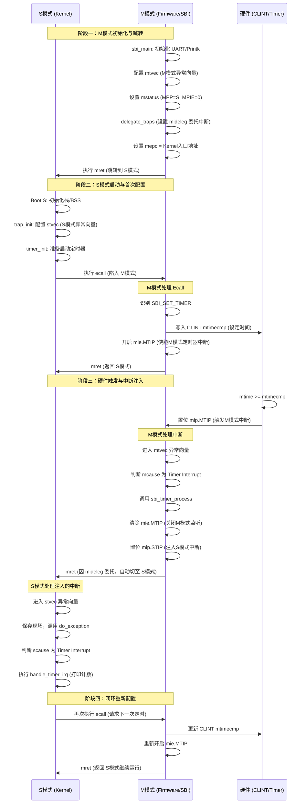

[TOC]

# 结合 lab9-1 代码的详细解释

## 1. **为什么 M 模式中断不能直接委派给 S 模式？**

在 RISC-V 架构中，**M 模式（Machine Mode）是最高特权级**，S 模式（Supervisor Mode）是较低特权级。根据 RISC-V 规范：

- **硬件定时器中断（MTIP）本质上是 M 模式的中断**
- 当 CLINT 定时器触发时，硬件会自动设置 `mip` 寄存器的 **MTIP 位**（第7位）
- 这个中断**天然属于 M 模式**，CPU 会在 M 模式下响应它

**关键问题：** 如果不做任何特殊处理，M 模式的定时器中断只能在 M 模式下处理，无法自动"降级"到 S 模式。

---

## 2. **中断注入机制：通过设置 MIP_STIP 实现"伪造"S 模式中断**

让我们看 [sbi_timer_process()](file:///home/alan/workspace/riscv/riscv_programming_practice/chapter_9/lab9-1/benos/sbi/sbi_timer.c#L6-L10) 函数：

```c
void sbi_timer_process(void)
{
    /* 关闭M模式timer的中断，然后设置S模式的timer pending中断*/
    csr_clear(mie, MIP_MTIP);   // ① 禁用M模式定时器中断
    csr_set(mip, MIP_STIP);     // ② 【关键】手动设置S模式定时器pending位
}
```

riscv-privileged.pdf原文：
> If supervisor mode is implemented, its mip.STIP and mie.STIE are the interrupt-pending and interrupt enable bits for supervisor-level timer interrupts. ***If the stimecmp register is not implemented, STIP is writable in mip, and may be written by M-mode software to deliver timer interrupts to S-mode***. If the stimecmp (supervisor-mode timer compare) register is implemented, STIP is read-only in mip and reflects the supervisor-level timer interrupt signal resulting from stimecmp. This timer interrupt signal is cleared by writing stimecmp with a value greater than the current time value.

**这里发生了什么：**

1. **硬件触发**：CLINT 定时器到达设定时间 → 硬件自动设置 `mip.MTIP = 1`
2. **M 模式捕获**：CPU 在 M 模式下进入异常处理（因为设置了 `mie.MTIP = 1`）
3. **中断注入**：
   - 清除 `mie.MTIP`：防止 M 模式再次响应这个定时器中断
   - **设置 `mip.STIP`**：这是**软件手动写入**的操作，相当于"伪造"了一个 S 模式的定时器中断

**为什么叫"注入"？**
- `mip.STIP` 通常应该由硬件在特定条件下设置
- 但在这里，**M 模式的固件代码主动设置它**，就像把一个中断"注入"到 S 模式
- 这样，虽然原始中断是 M 模式的 MTIP，但现在变成了 S 模式的 STIP

---

## 3. **mideleg 寄存器：让 S 模式能够接收"注入"的中断**

现在看 [delegate_traps()](file:///home/alan/workspace/riscv/riscv_programming_practice/chapter_9/lab9-1/benos/sbi/sbi_trap.c#L110-L123) 函数：

```c
void delegate_traps(void)
{
    unsigned long interrupts;
    unsigned long exceptions;

    interrupts = MIP_SSIP | MIP_STIP | MIP_SEIP;  // 包括 STIP！
    exceptions = ...;

    write_csr(mideleg, interrupts);   // 【关键】设置中断委托
    write_csr(medeleg, exceptions);
}
```

**mideleg (Machine Interrupt Delegation) 的作用：**

- 这是一个**控制寄存器**，决定哪些中断可以"委托"给 S 模式处理
- 当 `mideleg` 的某一位被设置为 1 时，对应的中断即使发生在 M 模式，也会**自动切换到 S 模式**来处理

**具体流程：**

```
① mideleg.STIP = 1 （在 delegate_traps 中设置）
       ↓
② M 模式代码执行 csr_set(mip, MIP_STIP) "注入"中断
       ↓
③ CPU 检测到 mip.STIP = 1 且 mideleg.STIP = 1
       ↓
④ CPU 自动从 M 模式切换到 S 模式
       ↓
⑤ CPU 跳转到 stvec 指向的 S 模式异常向量表
       ↓
⑥ S 模式的操作系统处理定时器中断
```

---

## 4. **完整的中断流转过程**

让我用 lab9-1 的完整代码来说明：

### **阶段一：初始化（M 模式）**

```c
// 在 sbi_main() 中
delegate_traps();  // 设置 mideleg.STIP = 1，允许 STIP 中断委托到 S 模式
write_csr(stvec, FW_JUMP_ADDR);  // 设置 S 模式异常向量表
```

### **阶段二：启动定时器（S 模式通过 ecall 调用）**

```c
// S 模式操作系统调用 SBI_SET_TIMER
case SBI_SET_TIMER:
    clint_timer_event_start(regs->a0);  // 启动定时器
    break;

// 在 clint_timer_event_start() 中
void clint_timer_event_start(unsigned long next_event)
{
    writeq(next_event, VIRT_CLINT_TIMER_CMP);  // 设置硬件定时器
    csr_clear(mip, MIP_STIP);   // 清除之前的 pending
    csr_set(mie, MIP_MTIP);     // 使能 M 模式定时器中断
}
```

### **阶段三：定时器触发（硬件 → M 模式）**

```
硬件定时器到达 → 设置 mip.MTIP = 1
       ↓
CPU 在 M 模式捕获中断（因为 mie.MTIP = 1）
       ↓
跳转到 mtvec → sbi_exception_vector → sbi_trap_handler
```

### **阶段四：中断注入（M 模式处理）**

```c
// 在 sbi_trap_handler() 中
case IRQ_M_TIMER:
    sbi_timer_process();  // 处理定时器中断
    break;

// 在 sbi_timer_process() 中
csr_clear(mie, MIP_MTIP);   // 禁用 M 模式定时器中断
csr_set(mip, MIP_STIP);     // 【注入】设置 S 模式定时器 pending
```

### **阶段五：委托到 S 模式（自动切换）**

```
由于 mideleg.STIP = 1 且 mip.STIP = 1
       ↓
CPU 自动从 M 模式切换到 S 模式
       ↓
CPU 跳转到 stvec 指向的 S 模式异常处理程序
       ↓
S 模式操作系统处理定时器中断（例如调度器 tick）
```

---

### 5. **总结对比**

| 机制                         | 作用                              | 代码位置                                                     |
| ---------------------------- | --------------------------------- | ------------------------------------------------------------ |
| **mideleg.STIP = 1**         | **允许** STIP 中断委托到 S 模式   | [delegate_traps()](file:///home/alan/workspace/riscv/riscv_programming_practice/chapter_9/lab9-1/benos/sbi/sbi_trap.c#L110-L123) |
| **csr_set(mip, MIP_STIP)**   | **实际注入**一个 S 模式定时器中断 | [sbi_timer_process()](file:///home/alan/workspace/riscv/riscv_programming_practice/chapter_9/lab9-1/benos/sbi/sbi_timer.c#L6-L10) |
| **csr_clear(mie, MIP_MTIP)** | 防止 M 模式重复响应               | [sbi_timer_process()](file:///home/alan/workspace/riscv/riscv_programming_practice/chapter_9/lab9-1/benos/sbi/sbi_timer.c#L6-L10) |

**核心理解：**
- **mideleg** 是"通行证"：告诉 CPU "STIP 这类中断可以交给 S 模式处理"
- **设置 mip.STIP** 是"实际行动"：真正创建一个 S 模式的中断请求
- 两者缺一不可：只有 mideleg 没有设置 mip.STIP，不会有中断；只设置 mip.STIP 没有 mideleg，中断仍会在 M 模式处理

这就是 RISC-V 中实现**中断分层管理**的精妙设计：M 模式固件负责底层硬件交互，然后通过中断注入和委托机制，将中断处理"传递"给 S 模式的操作系统。


## 我的总结

lab9-1的定时器中断流程是这样的：首先在M模式下，设置mtvec寄存器的异常向量表，在异常处理函数中，通过判断mcause的最高位来区分是异常还是中断。如果是异常说明是在S模式下调用ecall来配置timer，同时清除MIP.STIP，并开启MIE.MTIP，为下一次进入timer中断做好准备。当定时器中断到来时，会清除MIE.MTIP，并开启MIP.STIP来将中断注入S模式中处理。在S模式下的异常处理函数中（通过配置stevc中的异常向量表来处理注入的定时器中断）执行timer中断处理函数，此函数重新配置timer（调用ecall再次陷入M模式异常处理函数中使能timer中断）为下一次中断做准备，同时打印进入timer中断处理函数中的次数。


# RISC-V BenOS 启动与定时器中断全景流程


## **第一阶段：M 模式下的“铺路”工作 (Firmware Setup)**
在 [sbi_main.c](file:///home/alan/workspace/riscv/riscv_programming_practice/chapter_9/lab9-1/benos/sbi/sbi_main.c) 中，M 模式完成了所有通往 S 模式的准备工作：

1.  **基础环境搭建**：初始化串口，确保能打印调试信息。
2.  **异常向量表配置 (`mtvec`)**：指向 `sbi_exception_vector`，确保 M 模式下发生的任何异常（如 S 模式的 `ecall`）都能被捕获。
3.  **特权级切换准备 ([mstatus](file:///home/alan/workspace/riscv/riscv_programming_practice/chapter_9/lab9-3/sbi/sbi_trap.h#L82-L82))**：
    *   `MPP = PRV_S`：告诉 CPU，执行 `mret` 后请进入 **S 模式**。
    *   `MPIE = 0`：告诉 CPU，返回 S 模式后，先关闭 M 模式的全局中断，把控制权彻底交给 S 模式。
4.  **中断委托 ([delegate_traps](file:///home/alan/workspace/riscv/riscv_programming_practice/chapter_9/lab9-3/sbi/sbi_trap.h#L87-L87))**：
    *   设置 `mideleg` 寄存器，明确告诉硬件：**“如果发生 S 模式的软件中断、定时器中断或外部中断，请直接切到 S 模式处理，别在 M 模式逗留。”**
5.  **设置跳板 ([mepc](file:///home/alan/workspace/riscv/riscv_programming_practice/chapter_9/lab9-3/sbi/sbi_trap.h#L49-L49) & `stvec`)**：
    *   `mepc = 0x80200000`：这是 Kernel 的入口地址。
    *   `stvec = 0x80200000`：预先帮 S 模式填好异常向量表入口（通常 Boot.S 会再次覆盖它）。
6.  **临门一脚 (`mret`)**：CPU 根据 [mepc](file:///home/alan/workspace/riscv/riscv_programming_practice/chapter_9/lab9-3/sbi/sbi_trap.h#L49-L49) 跳转，并根据 `MPP` 切换特权级。

## **第二阶段：S 模式下的“点火”启动 (Kernel Boot)**
Kernel 的 [boot.S](file:///home/alan/workspace/riscv/riscv_programming_practice/chapter_10/lab10-1/benos/src/boot.S) 接手后：

1.  **环境初始化**：清理 `.bss` 段，建立内核栈。
2.  **接管异常向量 (`trap_init`)**：将 `stvec` 指向内核自己的 `do_exception_vector`。
3.  **启动定时器 ([timer_init](file:///home/alan/workspace/riscv/riscv_programming_practice/chapter_9/lab9-3/include/asm/timer.h#L4-L4))**：
    *   内核调用 [sbi_set_timer](file:///home/alan/workspace/riscv/riscv_programming_practice/chapter_9/lab9-3/include/asm/sbi.h#L30-L33)。
    *   **关键交互**：执行 `ecall` 指令，CPU 立即从 S 模式**陷入** M 模式。

## **第三阶段：M 模式下的“代理”配置 (SBI Handling)**
M 模式捕获到 `ecall` 后：

1.  **识别意图**：通过 `regs->a7` 发现是 [SBI_SET_TIMER](file:///home/alan/workspace/riscv/riscv_programming_practice/chapter_9/lab9-3/include/asm/sbi.h#L6-L7)。
2.  **操作硬件**：向 CLINT 的 `mtimecmp` 寄存器写入时间值。
3.  **开启监听**：设置 `mie.MTIP = 1`，表示“我现在开始盯着定时器了”。
4.  **返回**：`mret` 回到 S 模式继续执行。

## **第四阶段：中断注入与闭环 (Interrupt Injection Loop)**
当硬件定时器到期时：

1.  **硬件触发**：CLINT 置位 `mip.MTIP`。
2.  **M 模式捕获**：进入 [sbi_timer_process](file:///home/alan/workspace/riscv/riscv_programming_practice/chapter_9/lab9-3/sbi/sbi_timer.h#L3-L3)。
3.  **中断注入 (核心)**：
    *   关闭 `mie.MTIP`（防止 M 模式反复进入）。
    *   置位 `mip.STIP`（**伪造**一个 S 模式的中断请求）。
4.  **委托执行**：由于之前设置了 `mideleg`，CPU 自动切换到 S 模式，跳转到 `stvec`。
5.  **S 模式处理**：
    *   执行 [handle_timer_irq](file:///home/alan/workspace/riscv/riscv_programming_practice/chapter_9/lab9-3/include/asm/timer.h#L3-L3)（打印日志、更新计数器）。
    *   **重新配置**：再次调用 `ecall` 陷入 M 模式，设定下一次中断时间。
    *   **闭环完成**：M 模式再次开启 `mie.MTIP`，等待下一轮心跳。

## 总结：M 模式与 S 模式的分工

*   **M 模式 (Manager)**：负责**权限管理**和**硬件直通**。它不关心业务逻辑，只负责把 S 模式的请求翻译成硬件动作，并把硬件的中断“包装”好后递给 S 模式。
*   **S 模式 (Supervisor)**：负责**业务逻辑**。它通过 `ecall` 申请资源，通过异常处理函数响应事件。它感知不到底层硬件的复杂性，仿佛自己直接拥有定时器一样。

这种设计正是现代操作系统（如 Linux）运行在 Hypervisor 或固件之上的缩影。希望这个补充后的流程能让你对 lab9-1 的代码架构有更宏观的把握！——有的。





